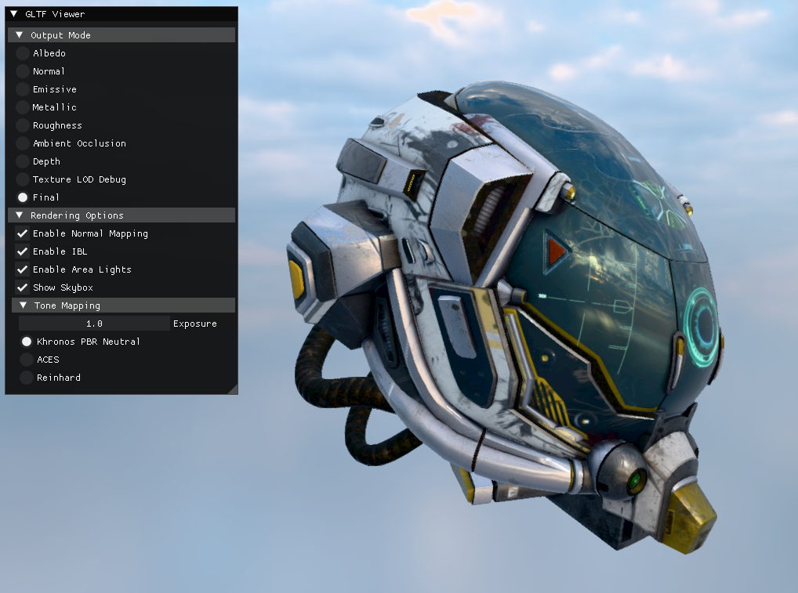
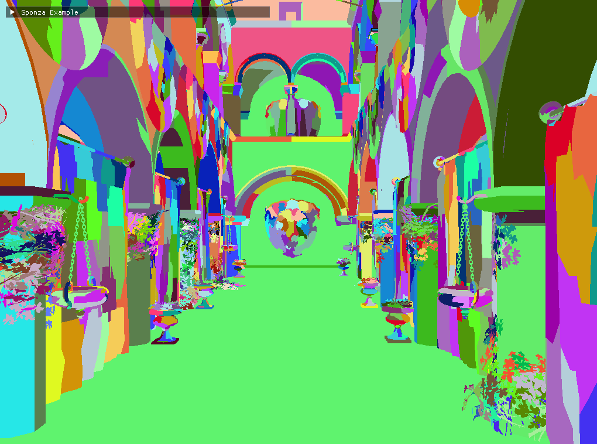

# VultraEngine

<h4 align="center">
  A C++23 game and rendering runtime built around Vulkan, WebGPU, OpenXR, data-driven assets, and editable render pipelines.
</h4>

<p align="center">
  <a href="https://github.com/zzxzzk115/VultraEngine/actions/workflows/build_windows.yaml">
    
  </a>
  <a href="https://github.com/zzxzzk115/VultraEngine/actions/workflows/build_linux.yaml">
    
  </a>
  <a href="https://github.com/zzxzzk115/VultraEngine/actions/workflows/build_macos.yaml">
    
  </a>
  <a href="https://github.com/zzxzzk115/VultraEngine/actions/workflows/build_android.yaml">
    
  </a>
  <a href="https://github.com/zzxzzk115/VultraEngine/actions/workflows/build_wasm.yaml">
    
  </a>
  <a href="https://github.com/zzxzzk115/VultraEngine/actions/workflows/deploy_pages.yaml">
    
  </a>
  <a href="https://www.codefactor.io/repository/github/zzxzzk115/VultraEngine">
    
  </a>
  <a href="https://github.com/zzxzzk115/VultraEngine/issues">
    
  </a>
  <a href="https://github.com/zzxzzk115/VultraEngine/blob/master/LICENSE">
    
  </a>
</p>

## What It Is

VultraEngine is split into two clear layers:

- `vultra`: the engine library. It is built as a static library and contains the core runtime, RHI, asset system, ECS/world layer, scripting, rendering systems, OpenXR integration, and platform backends.
- `vultra-app`: the application shell. The same executable can act as the project launcher, editor, command-line asset/shader tool host, and standalone packaged runtime.

The desktop runtime path is designed around a self-contained executable plus a `VPK` asset package. There is no separate Vultra engine DLL to ship beside the app: `vultra-app` can run directly from project resources while editing, or load cooked assets from `resources.vpk` for standalone runtime builds.

## Highlights

- Vulkan and WebGPU rendering backends behind a shared RHI.
- Native WebGPU and browser WebGPU through WebAssembly / Emscripten.
- OpenXR runtime support on the Vulkan backend, with scene-driven XR cameras, editor/runtime mirror views, and stereo render graph templates.
- Scriptable Render Pipeline architecture with data-driven renderers and editable `.vrg.json` render graphs.
- Render Graph editor with live runtime preview, runtime graph inspection, resource thumbnails, and Lua-authored project passes.
- Material Graph editor and compiler, including generated shader output and project material graph assets.
- Custom asset pipeline based on `vasset v0.3`, with import metadata, asset registries, source-to-runtime conversion, and package manifests.
- Custom virtual file system integration through `vfilesystem`, including `res://` URIs and mounted `VPK` packages.
- Integrated `vultra asset ...` and `vultra shader ...` command-line tools through `vultra-app`.
- `VPK` package import, compression, validation, loading, editor export, and export-and-run workflow.
- Lua scripting with engine service bindings for scene, entity, transform, input, timing, asset, render, and script access.
- Built-in renderer features including deferred lighting, shadow maps, SSAO, SSR, FXAA, tone mapping, selection outlines, meshlet/visibility-buffer paths, ray tracing examples, and Gaussian Splatting.
- Project launcher that creates `.vproject` workspaces with scenes, render graphs, shader libraries, scripts, assets, and AI workspace scaffolding.

## Platform Targets

| Platform | Primary backend | Notes |
| --- | --- | --- |
| Windows | Vulkan + WebGPU | Editor, launcher, runtime, tools, OpenXR, examples. |
| Linux | Vulkan + WebGPU | Editor/runtime path with SDL, optional Wayland configuration. |
| macOS | Vulkan + WebGPU | Desktop runtime/editor builds with packaged runtime rpaths. |
| Android | Vulkan | Runtime-oriented path with bundled `resources.vpk`. |
| Web | WebGPU | WebAssembly / Emscripten builds with preloaded `resources.vpk`. |

## Rendering

Vultra's rendering stack is built around SRP-style camera cooking, renderer selection, a frame graph, and declarative render graphs:

- `.vrg.json` stores render graph nodes, resources, editor layout, and pass parameters.
- `.vrp.lua` stores Lua-authored render pipeline or pass definitions.
- `.vshaderlib.lua` declares project shader libraries and shader globs.
- `.vmatgraph.json` stores material graphs, which compile to generated shader sources.

The built-in renderer includes compatibility and high-end paths, and the project graph system lets game projects replace or extend passes without forking the engine.

## Asset Pipeline

Vultra projects use a custom asset workflow:

- `.vproject` identifies the project, asset root, default scene, and editable render graph.
- `.vimport` files track imported sources and cooked outputs.
- `.vscn` stores scene entities and reflected component fields.
- `resources.vpk` is the runtime asset bundle.
- `res://` paths are resolved through the asset system and virtual file system.

Assets can be imported and packed from scripts:

```bash
./scripts/import.sh <repo-root> <asset-root>
./scripts/pack.sh <repo-root> <asset-root> <out.vpk>
```

On Windows PowerShell:

```powershell
.\scripts\import.ps1 <repo-root> <asset-root>
.\scripts\pack.ps1 <repo-root> <asset-root> <out.vpk>
```

The same functionality is available through the runtime tool host:

```bash
vultra asset import resources --reimport
vultra asset pack resources resources.vpk --zstd 6
vultra shader compile -i path/to/shader.vshader -o build/shaders
```

## Showcase

- [GLTF Viewer](./examples/gltf_viewer/main.cpp)
- [Demo App](./examples/demo_app/main.cpp)
- [Sponza SRP Example](./examples/sponza/main.cpp)
- [OpenXR Triangle](./examples/openxr/triangle/main.cpp)
- [OpenXR Sponza](./examples/openxr/sponza/main.cpp)
- [OpenXR Gaussian Splatting](./examples/openxr/gaussian_splatting/main.cpp)
- [ImGui Desktop + WASM](./examples/imgui/main.cpp)
- [Gaussian Splatting](./examples/gaussian_splatting/main.cpp)
- [Ray Tracing Examples](./examples/raytracing/)
- [Mesh Shading Example](./examples/meshshading/triangle/)




## Build

### Prerequisites

- Git
- XMake
- Vulkan SDK for Vulkan desktop targets
- Android SDK + NDK for Android
- Emscripten SDK for WebAssembly
- Visual Studio on Windows, or Clang/GCC on Linux/macOS

### Desktop

```bash
git clone --recursive https://github.com/zzxzzk115/VultraEngine.git
cd VultraEngine
git submodule update --init --recursive
xmake f -y
xmake build -y vultra-app
```

Run the launcher/editor:

```bash
xmake run vultra-app
```

Run a project in editor mode:

```bash
vultra --editor --project <project-dir>
```

Run a packaged project:

```bash
vultra --vpk resources.vpk --scene res://scenes/main.vscn
```

### WebAssembly

Build a host `vultra-app` first. The WASM asset packing rule runs before the
example build and uses that host executable to import resources and generate the
preloaded `resources.vpk`.

On Linux/macOS:

```bash
xmake f -y
xmake build -y vultra-app
xmake f -p wasm --vultra_build_examples=y --vultra_build_tests=n -y
xmake build -y example-demo-app
```

On Windows PowerShell:

```powershell
xmake f -y
xmake build -y vultra-app
xmake f -p wasm --vultra_build_examples=y --vultra_build_tests=n -y
xmake build -y example-demo-app
```

If the host executable lives outside the default build output, set `VULTRA` to
the full path before building the WASM example. `example-demo-app` and
`example-gaussian-splatting` use `resources.vpk_pack` to import selected
resources, pack `build/.generated/wasm_resources/<target>/resources.vpk`, and
preload it into the Emscripten filesystem at `/resources.vpk`.

### Android

```bash
xmake f -p android --ndk=/path/to/Android/Sdk/ndk/30.0.14904198 --vultra_build_examples=n --vultra_build_tests=n -y
xmake build -y
```

## Run Examples

```bash
xmake run example-demo-app
xmake run example-imgui
xmake run example-gltf-viewer
xmake run example-sponza
xmake run example-gaussian-splatting
xmake run example-openxr-triangle
```

## Starter Template

Create an external project with:

- [VultraEngine-starter-template](https://github.com/zzxzzk115/VultraEngine-starter-template)

For Android host integration reference:

- [`template/android`](./template/android/)
- [`examples/android_app`](./examples/android_app/)

## License

VultraEngine is released under the [MIT](LICENSE) license.
