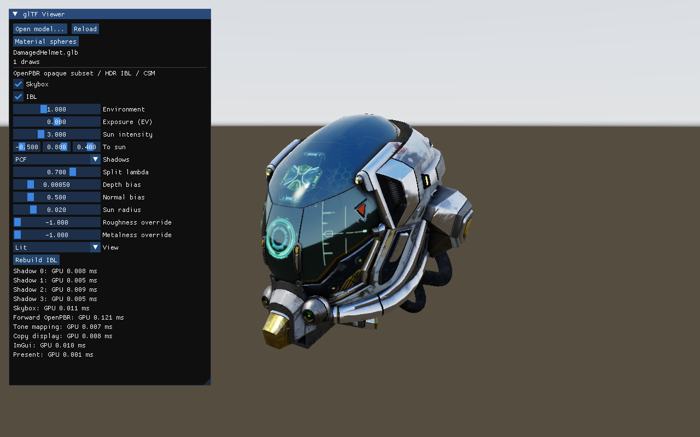
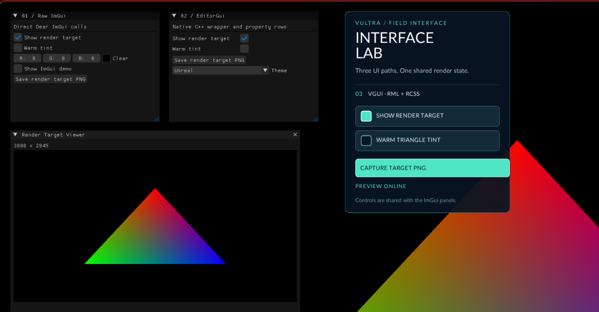

# libvultra

<h4 align="center">
  A small rendering research framework built on VRI, with readable C++ and Slang code you can adapt to your own experiments.
</h4>

The `dev-VRI` branch is a small VRI-based rendering research framework within libvultra. It is under early development. The build targets are **Windows x64 and Linux x86_64 + Vulkan**. Both platforms have been exercised; see the [verification requirements and limits](docs/guide.md#verification).

## Features

- VRI device and resource access, with selectable GLFW or SDL3 desktop windows
- BaseApp, DesktopApp and ImGuiApp application lifecycles
- Window-owned keyboard/mouse input and reusable Orbit/FPS camera controllers
- An explicit RenderGraph with context-owned pass definitions and version-1 JSON graph definitions
- Slang shaders with FileWatch hot reload
- ImGui docking and multiple native viewports on Windows/X11, per-application layouts and an Unreal-style default theme
- Optional RmlUi-based VGui with an embedded PNG skin for common game UI controls
- A built-in renderer with naive deferred and forward paths, an opaque OpenPBR subset, HDR IBL and cascaded shadows
- Optional scene cameras, lights, materials and environments with incremental synchronization shared by C++, native/Lua/C# scripts and both renderer paths
- A lightweight asset pipeline that caches generated mip levels and BC7 data textures without duplicating source assets
- Hardware ray-query, ray-tracing and task/mesh shader examples
- A static glTF/GLB viewer with model selection and Damaged Helmet as the default model
- OpenXR stereo rendering with a desktop mirror
- PNG capture, frame dumps, SSIM/PSNR, benchmark reports and CPU/GPU profiling
- Windowless `vultra-batch`, version-1 experiment descriptions and optional safe Python/NumPy research sessions
- Progressive reference path tracing with marked AOVs, explicit history and reproducible convergence tests
- Graph memory/producer reports, nested CPU/GPU events and offscreen RenderDoc capture
- `vultra-app` research workbench: node graph editing, scene/resource inspection, output previews and saved workspaces; offline UI capture

The source is organized by `core`, `platform`, `drivers`, `assets`, `servers`, `scene`, `ui`, `main` and `api`, with optional `scripting`. A single public `vultra` static library supports direct VRI experiments; `vultra-scripting` adds native, Lua and C# project modules. See the [early engine architecture](docs/architecture.md) and [research core milestones](docs/research_milestones.md).

## Showcase

[Example: glTF Viewer](examples/scene/helmet.cpp)



[Example: UI Showcase](examples/ui/main.cpp)



The Damaged Helmet model retains its upstream [attribution and asset licenses](resources/models/DamagedHelmet/README.vultra.md).

## Build Instructions

Prerequisites:

- Windows: Visual Studio 2022 with the C++ toolchain
- Linux: a C++23 compiler, CMake, pkg-config, Python 3, Vulkan loader/development files, X11/Wayland development libraries, wayland-protocols and xkbcommon
- .NET 10 SDK when building `example-scripting` or every target with `xmake build --all`; the packaged C# runtime also needs an installed .NET 10 runtime
- [xmake](https://xmake.io/guide/quick-start.html#installation) on PATH
- A Vulkan 1.3 capable GPU and driver
- An active OpenXR runtime with a compatible headset or simulated device to run XR examples

From the repository root on the `dev-VRI` branch:

```powershell
xmake f -m release -y
xmake build -y --all
xmake run example-basics window --frames 60
```

xmake resolves dependencies through the configured repositories. Slang 2026.11 and the Linux OpenXR 1.1.49 loader are built from pinned source as static libraries; the initial Slang build takes longer than the former prebuilt package. See [external/xmake.lua](external/xmake.lua) for dependency versions, [local static package recipes](external/packages/packages) and the [local VRI patch](external/vri/README.md) for validation-layer resize handling.

Model example builds prepare their default asset caches before launch. Unchanged assets are verified and reused; missing or stale caches are rebuilt. Run `xmake build example-assets` to prepare all default model caches explicitly. Runtime-selected models retain on-demand import. See [build-time asset preparation](docs/asset_pipeline.md#build-time-preparation) for scope and cache behavior.

The project explicitly enables `run.autobuild`: `xmake run <target>` first builds that target and checks its asset dependencies. Run a named category and mode; category targets without a mode print their mode list. Tests are separate and run with `xmake test`. Use `xmake run` to provide the package DLL search paths; all examples use the repository root as their working directory.

On Linux, both **GLFW (default) and SDL3** support X11/XWayland and native Wayland. Select the backend at build time and the window system at launch:

```sh
xmake f -m release --libvultra_window_backend=sdl3 -y
xmake build -y --all
VULTRA_WINDOW_SYSTEM=wayland xmake run example-ui --frames 60
VULTRA_WINDOW_SYSTEM=x11 xmake run example-ui --frames 60
```

Use `--libvultra_window_backend=glfw` to restore GLFW. Without `VULTRA_WINDOW_SYSTEM`, the selected library chooses its available window system. Wayland retains in-window docking; detached ImGui viewports require Windows or X11 because the pinned upstream ImGui backends do not support them on Wayland. See [desktop platform contracts](docs/guide.md#desktop-platforms) and [Linux test requirements](docs/guide.md#verification).

The Linux model picker uses Native File Dialog Extended with D-Bus and `xdg-desktop-portal`; install a portal backend for your desktop. It has an X11 parent; on Wayland it opens without a parent and logs that NFD 1.3 limitation. The OpenXR loader is linked into the executable on Linux. An active OpenXR runtime/device is needed only for XR execution; [Monado simulated-device setup](docs/monado.md) provides a local development runtime without a physical headset.

For desktop development without OpenXR:

```powershell
xmake f -m release --libvultra_with_openxr=n -y
xmake build -y --all
```

The `libvultra_build_examples`, `libvultra_build_tests` and `libvultra_with_openxr` options are enabled by default. Set `--libvultra_with_openxr=y` to restore XR support.

The packaged player supports either `vultra-runtime` plus a project VPK or a single executable with the project VPK appended. Built-in Slang shaders are already embedded in the runtime. The sample package includes a RmlUi HUD; the ImGui debugger remains optional with `--debug-ui`. After building the tools, export and launch use their executables directly; xmake is not needed on the target machine:

```sh
xmake build vultra-pack vultra-runtime
./build/linux/x86_64/release/vultra-pack resources/research.vproject build/.tmp/research.vpk
./build/linux/x86_64/release/vultra-pack --embed ./build/linux/x86_64/release/vultra-runtime build/.tmp/research.vpk build/.tmp/research-game
./build/.tmp/research-game --frames 60
```

The unmodified runtime still accepts an external VPK path. Add `--debug-ui` to either launch form for the ImGui renderer/RenderGraph panel; F1 toggles it. `VpkArchive::packProject()` and `VpkArchive::embedProject()` also expose the two export steps to a future editor without invoking xmake. The player imports mesh nodes at startup, updates their GPU transforms after script callbacks, and loads independent native extensions plus node-attached C++, Lua 5.4 and C# scripts through one C ABI. Lua is linked statically; C# projects need an installed .NET 10 runtime. `example-scripting` renders a small arena driven by a native extension and C++ movement, Lua pickup rules and C# throttle control, with development hot reload. The separate C-only plugin demonstrates the ABI in `example-ui`. Linux still requires the system Vulkan loader, graphics driver and display stack. See [project package and runtime](docs/guide.md#project-package-and-runtime) for the format and delivery limits.

## Examples

Run a category with `xmake run <target> <mode> [options]`. With no mode, a category lists its modes. `xmake run <target> --help` shows the same list; `xmake run <target> <mode> --help` shows that mode's options.

| Target | Modes and focus |
| --- | --- |
| `example-basics` | `window` swapchain clear; `vri` indexed draw; `graph` RenderGraph; `mesh-shading` task/mesh shader |
| `example-ui` | One scene controlled by raw ImGui, C++ EditorGui and VGui; built-in and Kenney PNG skins appear side by side |
| `example-scene` | `helmet` glTF viewer; `debug` wireframes; `sponza` first-person renderer; `sponza-mesh-shading` indexed/mesh comparison |
| `example-ray` | `triangle` ray tracing; `cornell` primary/shadow rays; `query` rasterized ray-query shadows |
| `example-xr` | `triangle` stereo mirror; `sponza` per-eye scene rendering (requires an OpenXR runtime) |
| `example-research` | Deferred/forward renderer, RenderGraph observer, intermediate captures and benchmarks |

```powershell
xmake run example-basics graph --frames 3
xmake run example-basics mesh-shading --frames 3
xmake run example-ui --frames 60
xmake run example-scene helmet examples/scene/box.gltf --frames 3
xmake run example-scene sponza --frames 3
xmake run example-scene sponza-mesh-shading --meshlet-colors --frames 3
xmake run example-ray query --frames 3
xmake run example-research --frames 60 --dump captures/run01
xmake run example-xr triangle --frames 60
```

Use `--help` for each example's options. Common options include `--frames`, `--log-level` and `--log-file`. Close the desktop window or press Esc to exit. In the glTF Viewer and Debug Draw examples, left-drag outside the UI to orbit, middle/right-drag to pan and scroll to zoom. First-person examples use WASD to move, QE to descend/ascend, right-drag to look and Shift to accelerate. These controllers live in `scene/camera` and use the window's input; see [input and camera controls](docs/guide.md#input-and-camera-controls).

Sponza and ray-query controls use WASD/QE to move, right-drag to look and Shift to move faster. Advanced examples require their corresponding Vulkan hardware features.

The [asset pipeline](docs/asset_pipeline.md) keeps original files unchanged and stores derived data under `.vultra/assets/`. It accepts static glTF/GLB, OBJ and FBX models, including 2D DDS material textures. Image decoding, geometry processing, texture preparation and cache loading use `vtask` jobs with stage/progress logs. Use `--reimport` to rebuild, `--import-jobs N` to limit workers or `--compression none` for an uncompressed reference. `xmake run vultra-import <model>` imports without a GPU.

The [scripting examples](docs/guide.md#generated-api-and-scripting) use a versioned C ABI generated from annotated C++ declarations; C# layout bindings are generated from the same IR. Normal builds use checked-in output; Python, libclang and clang-format are needed only for `xmake codegen` and `xmake codegen --check`.

ImGui layouts load and save automatically under `.vultra/<AppName>/imgui.ini`. AppName defaults to the executable name, so category targets keep separate layouts while modes within one category share a layout. See [GUI configuration](docs/guide.md#imgui-and-layouts) to override or disable persistence.

## Create Your Own Research Application

Start with [the window example](examples/basics/window.cpp), then read [the research example](examples/research/main.cpp) for built-in pass composition, graph observation, hot reload and capture. Use `DesktopApp` for a desktop application or `ImGuiApp` for one with UI.

Use `add_deps("vultra")` for direct VRI, RenderGraph, asset import, built-in passes and EditorGui. Add `vultra-vgui` only for authored RmlUi interfaces. `SceneData` is CPU-only; construct `GpuScene` directly or use a `RenderingServer`-owned `GpuSceneHandle` when lifetime-checked IDs are useful. The scene layer is optional for research applications.

The [development guide](docs/guide.md) covers source layout, application callbacks, shader modules, the renderer, image metrics and OpenXR. Run `scripts/setup_vscode.ps1` on Windows, or `sh scripts/setup_vscode.sh` from a compatible shell, to configure clangd and Slang without replacing personal editor settings.

For xmake target/option Tab completion, source `scripts/setup_xmake_completion.zsh` in zsh or dot-source `scripts/setup_xmake_completion.ps1` in PowerShell. See [shell completion setup](docs/guide.md#shell-completion) for persistent profile loading.

## Current Scope

The renderer exposes an **opaque OpenPBR subset**; its IBL uses a separate GGX split-sum approximation. The glTF loader handles static scenes, with unsupported features listed in the [guide](docs/guide.md#gltf-support). This is not a complete OpenPBR or glTF implementation.

The RenderGraph currently uses one graphics queue. Version-1 JSON graph definitions and the minimal research workbench use its existing executor. The workbench edits authored scene snapshots and numeric pass parameters; the generated experiment API exposes graph configuration to optional Python research sessions. Explicit texture history and opt-in transient reuse are available. Its node canvas connects project passes with built-in scene outputs; individual built-in renderer passes are not yet editable graph nodes. Gaussian Splatting is outside the current scope. Ray tracing and mesh shading remain focused examples; [reference transport](docs/reference_renderer.md) runs in the workbench, batch and [Python sessions](docs/python_research.md). [Follow-up tasks](docs/future_tasks.md) distinguish remaining milestone gates from dev-next feature candidates. See the [example coverage table](docs/example_parity.md) for differences from `dev`, including lighting and renderer paths that are not yet ported.

OpenXR requires an available runtime device. Offscreen color tests and Monado simulated-device eye/mirror rendering have been verified; physical-headset validation remains outstanding.

## Contributing

AI-assisted contributions are allowed and must follow [AGENTS.md](AGENTS.md). Keep changes small, readable and independently maintainable. Repository documentation is written in English.

Run `xmake test -v` for the test suite. Follow the checked-in `.clang-format` and `.clang-tidy` configurations for code changes. See [verification](docs/guide.md#verification) for the scope of these checks.

## Acknowledgements

- [Adobe OpenPBR BSDF](https://github.com/adobe/openpbr-bsdf): public Slang implementation
- [FileWatch](https://github.com/ThomasMonkman/filewatch): file-change notifications for shader hot reload
- [VRI](https://github.com/zzxzzk115/VRI): rendering abstraction and Vulkan backend
- [GLFW](https://github.com/glfw/glfw): desktop windows and input
- [SDL3](https://github.com/libsdl-org/SDL/tree/release-3.4.0): optional desktop window/input backend (zlib license)
- [Native File Dialog Extended](https://github.com/btzy/nativefiledialog-extended/tree/v1.3.0): Linux portal model picker (zlib license)
- [Dear ImGui](https://github.com/ocornut/imgui): immediate-mode UI, docking and multiple viewports
- [imgui-node-editor](https://github.com/thedmd/imgui-node-editor): optional research editor node canvas (MIT)
- [Slang](https://github.com/shader-slang/slang): shader compilation to SPIR-V
- [argparse](https://github.com/p-ranav/argparse): command-line argument parsing
- [spdlog](https://github.com/gabime/spdlog): console and file logging
- [stb](https://github.com/nothings/stb): image loading, SIMD mip filtering and PNG writing
- [VTask](https://github.com/zzxzzk115/vtask): parallel loading, geometry and texture import jobs
- [meshoptimizer](https://github.com/zeux/meshoptimizer): meshlet construction and bounds, inherited from `dev`
- [OpenFBX](https://github.com/nem0/OpenFBX): static FBX scene loading
- [DirectXTex](https://github.com/microsoft/DirectXTex): CPU DDS loading and block decompression
- [TinyObjLoader](https://github.com/tinyobjloader/tinyobjloader): original OBJ/MTL loading
- [bc7enc_rdo](https://github.com/richgel999/bc7enc_rdo): direct SIMD BC7 encoding
- [xxHash](https://github.com/Cyan4973/xxHash): source and derived-data content hashes
- [TinyGLTF](https://github.com/syoyo/tinygltf): glTF and GLB scene loading
- [GLM](https://github.com/g-truc/glm): vector and matrix math
- [OpenXR SDK](https://github.com/KhronosGroup/OpenXR-SDK): OpenXR headers and runtime loader
- [Vulkan-Headers](https://github.com/KhronosGroup/Vulkan-Headers): Vulkan API declarations
- [nlohmann/json](https://github.com/nlohmann/json): asset metadata, graph definitions and workspace persistence

## License

Vultra is licensed under the [MIT License](LICENSE). Third-party code and assets retain their own licenses; see [OpenPBR](external/openpbr/README.vultra.md), [FileWatch](external/FileWatch/LICENSE), [BC7 encoder](external/bc7enc/README.md) and [asset attribution](resources/README.md).
