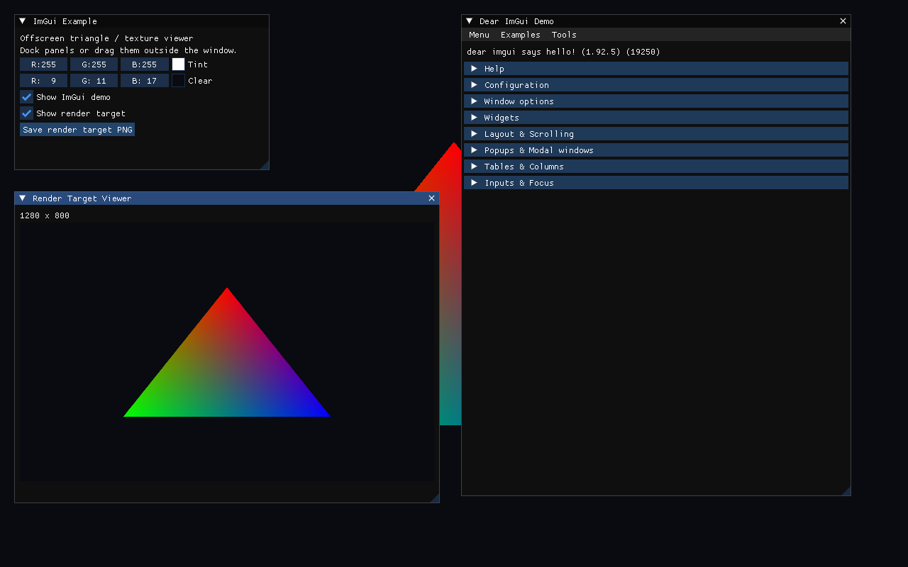

# libvultra

<h4 align="center">
  A small rendering research framework built on VRI, with readable C++ and Slang code you can adapt to your own experiments.
</h4>

The `dev-VRI` branch is a small VRI-based rendering research framework within libvultra. It is under early development. The current target is **Windows x64 + Vulkan**.

## Features

- VRI device and resource access, with GLFW desktop windows
- BaseApp, DesktopApp and ImGuiApp application lifecycles
- Window-owned keyboard/mouse input and reusable Orbit/FPS camera controllers
- An explicit, code-driven RenderGraph
- Slang shaders with FileWatch hot reload
- ImGui docking and multiple native viewports, per-application layouts and an Unreal-style default theme
- A built-in renderer with skybox, an opaque OpenPBR material subset, HDR IBL and cascaded shadows with Hard/PCF/PCSS filtering
- A lightweight asset pipeline that caches generated mip levels and BC7 data textures without duplicating source assets
- Hardware ray-query, ray-tracing and task/mesh shader examples
- A static glTF/GLB viewer with model selection and Damaged Helmet as the default model
- OpenXR stereo rendering with a desktop mirror
- PNG capture, frame dumps, SSIM/PSNR and CPU/GPU profiling

This branch keeps the `core / function / platform` organization of `dev` and the xmake-template build setup. Experiments can use VRI directly or build on the included passes.

## Showcase

[Example: glTF Viewer](examples/gltf_viewer/main.cpp)


[Example: ImGui and Render Target Viewer](examples/imgui/main.cpp)



The Damaged Helmet model retains its upstream [attribution and asset licenses](resources/models/DamagedHelmet/README.vultra.md).

## Build Instructions

Prerequisites:

- Visual Studio 2022 with the C++ toolchain
- [xmake](https://xmake.io/guide/quick-start.html#installation) on PATH
- A Vulkan 1.3 capable GPU and driver
- An active OpenXR runtime and a compatible headset to run the XR example

From the repository root on the `dev-VRI` branch:

```powershell
xmake f -m release -y
xmake build -y --all
xmake run
```

xmake resolves dependencies through the configured `xmake-repo` `backup` branch. Slang uses a prebuilt package. See [external/xmake.lua](external/xmake.lua) for dependency versions.

Model example builds prepare their default asset caches before launch. Unchanged assets are verified and reused; missing or stale caches are rebuilt. Run `xmake build example-assets` to prepare all default model caches explicitly. Runtime-selected models retain on-demand import. See [build-time asset preparation](docs/asset_pipeline.md#build-time-preparation) for scope and cache behavior.

The project explicitly enables `run.autobuild`: `xmake run <example>` first builds that example and checks its asset dependencies. `xmake run` builds and then runs all enabled examples in sequence; close the current example to continue. Tests are separate and run with `xmake test`. Use `xmake run` to provide the package DLL search paths; all examples use the repository root as their working directory.

For desktop development without OpenXR:

```powershell
xmake f -m release --libvultra_with_openxr=n -y
xmake build -y --all
```

The `libvultra_build_examples`, `libvultra_build_tests` and `libvultra_with_openxr` options are enabled by default. Set `--libvultra_with_openxr=y` to restore XR support.

## Examples

Run an individual example with `xmake run <target>`:

| Target | Description |
| --- | --- |
| `example-window` | Minimal DesktopApp and a clear pass |
| `example-rhi-triangle` | Indexed drawing and explicit VRI barriers |
| `example-rendergraph-triangle` | RenderGraph setup, pass culling and timing |
| `example-imgui` | Docking, detached windows, offscreen rendering and PNG export |
| `example-debugdraw` | Damaged Helmet with model bounds, grid, axes and sphere wireframes |
| `example-gltf-viewer` | Model selection, OpenPBR, IBL and cascaded shadows |
| `example-sponza` | Original Sponza and HDR assets, first-person controls, OpenPBR and cascaded shadows |
| `example-rayquery` | Original shadow scene with fragment-stage hardware ray queries |
| `example-raytracing-triangle` | Raygen, miss, closest-hit and shader binding table |
| `example-raytracing-cornell-box` | Original OBJ/MTL with primary and shadow rays |
| `example-meshshading-triangle` | Task + mesh shader pipeline |
| `example-meshshading-sponza` | Original Sponza, meshoptimizer meshlets, task-stage frustum culling and meshlet colors |
| `example-openxr-sponza` | Per-eye Sponza rendering, tracked pose and desktop mirror |
| `example-research` | Shader reload, image metrics, capture and frame dumps |
| `example-openxr-triangle` | Stereo triangle and a side-by-side desktop mirror |

```powershell
xmake run example-gltf-viewer
xmake run example-imgui
xmake run example-gltf-viewer examples/gltf_viewer/box.gltf --frames 3
xmake run example-gltf-viewer --materials --shadows pcss --frames 3 --capture captures/materials.png
xmake run example-research --frames 60 --dump captures/run01
xmake run example-openxr-triangle --frames 60
```

Use `--help` for each example's options. Common options include `--frames`, `--log-level` and `--log-file`. Close the desktop window or press Esc to exit. In the glTF Viewer and Debug Draw examples, left-drag outside the UI to orbit, middle/right-drag to pan and scroll to zoom. First-person examples use WASD to move, QE to descend/ascend, right-drag to look and Shift to accelerate. These controllers live in `function/camera` and use the window's input; see [input and camera controls](docs/guide.md#input-and-camera-controls).

Sponza and ray-query controls use WASD/QE to move, right-drag to look and Shift to move faster. Advanced examples require their corresponding Vulkan hardware features.

The [asset pipeline](docs/asset_pipeline.md) keeps original files unchanged and stores derived data under `.vultra/assets/`. It accepts static glTF/GLB, OBJ and FBX models, including 2D DDS material textures. Image decoding, geometry processing, texture preparation and cache loading use `vtask` jobs with stage/progress logs. Use `--reimport` to rebuild, `--import-jobs N` to limit workers or `--compression none` for an uncompressed reference. `xmake run vultra-import <model>` imports without a GPU.

ImGui layouts load and save automatically under `.vultra/<AppName>/imgui.ini`. AppName defaults to the executable name, so examples sharing the same working directory keep independent layouts. See [GUI configuration](docs/guide.md#imgui-and-layouts) to override or disable persistence.

## Create Your Own Research Application

Start with [the window example](examples/window/main.cpp), then read [the research example](examples/research/main.cpp) for explicit graph setup, hot reload and capture. Use `DesktopApp` for a desktop application or `ImGuiApp` for one with UI.

Link `vultra` for the application, RenderGraph, GUI and research utilities. Add `vultra-renderer` when you need scene loading and the built-in rendering passes. VRI descriptors and commands remain available directly.

The [development guide](docs/guide.md) covers source layout, application callbacks, shader modules, the renderer, image metrics and OpenXR. Run `scripts/setup_vscode.ps1` on Windows, or `sh scripts/setup_vscode.sh` from a compatible shell, to configure clangd and Slang without replacing personal editor settings.

## Current Scope

The renderer exposes an **opaque OpenPBR subset**; its IBL uses a separate GGX split-sum approximation. The glTF loader handles static scenes, with unsupported features listed in the [guide](docs/guide.md#gltf-support). This is not a complete OpenPBR or glTF implementation.

The RenderGraph currently uses one graphics queue. Data-driven or Python/Lua graph construction is a future extension. Gaussian Splatting and a graph editor are excluded. Ray tracing and mesh shading are available as focused examples. See the [example coverage table](docs/example_parity.md) for differences from `dev`, including lighting and renderer paths that are not yet ported.

OpenXR requires an available headset. Offscreen color and mirror tests are covered; the real headset and runtime mirror path still need hardware validation.

## Contributing

AI-assisted contributions are allowed and must follow [AGENTS.md](AGENTS.md). Keep changes small, readable and independently maintainable. Repository documentation is written in English.

Run `xmake test -v` for the test suite. Follow the checked-in `.clang-format` and `.clang-tidy` configurations for code changes. See [verification](docs/guide.md#verification) for the scope of these checks.

## Acknowledgements

- [Adobe OpenPBR BSDF](https://github.com/adobe/openpbr-bsdf): public Slang implementation
- [FileWatch](https://github.com/ThomasMonkman/filewatch): file-change notifications for shader hot reload
- [VRI](https://github.com/zzxzzk115/VRI): rendering abstraction and Vulkan backend
- [GLFW](https://github.com/glfw/glfw): desktop windows and input
- [Dear ImGui](https://github.com/ocornut/imgui): immediate-mode UI, docking and multiple viewports
- [Slang](https://github.com/shader-slang/slang): shader compilation to SPIR-V
- [argparse](https://github.com/p-ranav/argparse): command-line argument parsing
- [spdlog](https://github.com/gabime/spdlog): console and file logging
- [stb](https://github.com/nothings/stb): image loading, SIMD mip filtering and PNG writing
- [VTask](https://github.com/zzxzzk115/vtask): parallel loading, geometry and texture import jobs
- [meshoptimizer](https://github.com/zeux/meshoptimizer): meshlet construction and bounds, inherited from `dev`
- [OpenFBX](https://github.com/nem0/OpenFBX): static FBX scene loading
- [DirectXTex](https://github.com/microsoft/DirectXTex): CPU DDS loading and block decompression
- [TinyObjLoader](https://github.com/tinyobjloader/tinyobjloader): original OBJ/MTL loading
- [bc7enc_rdo](https://github.com/richgel999/bc7enc_rdo): direct SIMD BC7 encoding
- [xxHash](https://github.com/Cyan4973/xxHash): source and derived-data content hashes
- [TinyGLTF](https://github.com/syoyo/tinygltf): glTF and GLB scene loading
- [GLM](https://github.com/g-truc/glm): vector and matrix math
- [OpenXR SDK](https://github.com/KhronosGroup/OpenXR-SDK): OpenXR headers and runtime loader
- [Vulkan-Headers](https://github.com/KhronosGroup/Vulkan-Headers): Vulkan API declarations
- [nlohmann/json](https://github.com/nlohmann/json): asset-cache metadata parsing

## License

Vultra is licensed under the [MIT License](LICENSE). Third-party code and assets retain their own licenses; see [OpenPBR](external/openpbr/README.vultra.md), [FileWatch](external/FileWatch/LICENSE), [BC7 encoder](external/bc7enc/README.md) and [asset attribution](resources/README.md).
