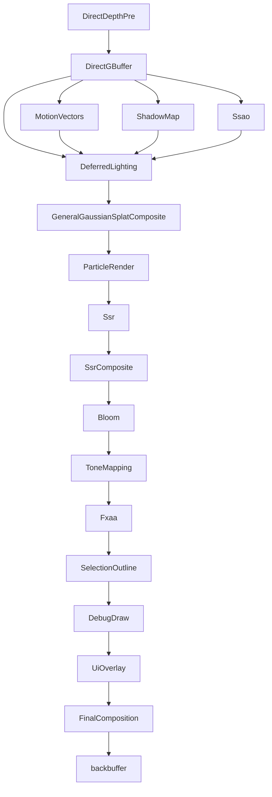

# GPU-Driven Pipeline

**English** | [简体中文](zh_CN/gpu_driven_pipeline_CN.md)

This document describes the **renderer architecture** of libvultra as it exists in
the current code. The original design intent of this subsystem is:

- **GPU-driven rendering** (compute culling + indirect draws for meshlet geometry)
- **High compatibility** (no mesh/task shaders required)
- **FrameGraph-based scheduling**
- **Meshlet geometry pipeline** with a **visibility buffer** path
- **Extensibility** for screen-space effects, shadows, and post-processing

The most important thing to understand up front is **how passes are wired today**:

> The renderer is **declarative**. Passes are composed from a JSON render graph
> (`*.vrg.json`) that is loaded and built by `DeclarativeRenderer`
> (`source/vultra/src/function/rendering/srp/declarative_renderer.cpp`). Each node
> `type` in the graph resolves to a self-registering **builtin pass adapter**
> (`IBuiltinRenderGraphPass`) declared in
> `builtin_passes_gpu_scene.cpp`, `builtin_passes_scene.cpp`, and
> `builtin_passes_post_process.cpp`. Some graph node types instead resolve to a
> `RenderFeature` (via `makeBuiltinFeature`). There is **no** fixed, hand-wired
> chain of `RenderFeature` classes driving the default frame.

The underlying FrameGraph (`fg::FrameGraph`) is still responsible only for:

- resource lifetime
- dependency tracking
- pass scheduling

Pass bodies and resource production remain code-driven inside each adapter/pass.

---

# 1. High-Level Pipeline (the shipped default graph)

The default high-end pipeline is defined by `builtin/render/universal.vrg.json`.
It is a deferred renderer built around `DirectGBuffer` + `DeferredLighting`.
It **does not** use the meshlet / visibility-buffer path (see Section 5).

> Note on naming: the file is still named `universal.vrg.json`. A rename to
> `universal_highend.vrg.json` is planned but **not yet applied**; reference the
> current name. Two tier variants also exist: `universal_compat.vrg.json` and
> `universal_rt.vrg.json`.

The node graph (each node is a builtin pass adapter; arrows are input/output
resource dependencies declared in the JSON):



Pass list, in graph order, with node `type`:

| Node id | type | Role |
|------|------|------|
| DirectDepthPre | `DirectDepthPre` | Depth pre-pass (early-Z) |
| DirectGBuffer | `DirectGBuffer` | Deferred GBuffer fill (color/normal/material/emissive/entityId + depth) |
| MotionVectors | `MotionVectors` | Per-pixel motion vectors |
| ShadowMap | `ShadowMap` | Cascaded shadow map (4 cascades by default) |
| Ssao | `Ssao` | Screen-space ambient occlusion (disabled by default param) |
| DeferredLighting | `DeferredLighting` | Single fullscreen deferred shading pass |
| GeneralGaussianSplatComposite | `GeneralGaussianSplatComposite` | Composites 3DGS splats over lit color |
| ParticleRender | `ParticleRender` | Forward particle rendering |
| Ssr | `Ssr` | Screen-space reflections trace (disabled by default param) |
| SsrComposite | `SsrComposite` | Composites SSR over color (disabled by default param) |
| Bloom | `Bloom` | Bloom |
| ToneMapping | `ToneMapping` | HDR -> tone-mapped color (intermediate target) |
| Fxaa | `Fxaa` | FXAA anti-aliasing |
| SelectionOutline | `SelectionOutline` | Editor selection outline (uses entityId) |
| DebugDraw | `DebugDraw` | Debug line/shape overlay |
| UiOverlay | `UiOverlay` | ImGui / UI overlay |
| FinalComposition | `FinalComposition` | Writes the **backbuffer** |

The `enabled` flags and `params` in the JSON (e.g. `Ssao.enabled = false`,
`Ssr.enabled = false`) control whether a pass does work; the wiring is always
present.

---

# 2. Builtin Pass Adapters

A builtin pass adapter implements `IBuiltinRenderGraphPass`. Each adapter:

- **owns** the rhi pass object(s) it drives,
- declares its node port/param spec(s) in `specs()` (the single source of truth
  for slot names and parameters),
- runs its per-frame build body in `build()`.

Owner state (the live build context, services, per-frame flags) is reached
through `BuiltinPassHost`. The full catalog is composed by
`makeBuiltinRenderGraphPasses()` from the per-file append functions in:

- `builtin_passes_gpu_scene.cpp` (meshlet culling chain, gaussian splat, particles)
- `builtin_passes_scene.cpp` (`DirectDepthPre`, `DirectGBuffer`, `DeferredLighting`, `ShadowMap`, ...)
- `builtin_passes_post_process.cpp` (`Ssao`, `Ssr`/`SsrComposite`, `Bloom`, `ToneMapping`, `Fxaa`, `Hzb`, `FinalComposition`, ...)

A handful of node types resolve to a `RenderFeature` instead of a single adapter
via `makeBuiltinFeature()` in `declarative_renderer.cpp`
(`compatibility_basecolor`, `direct_gbuffer`, `meshlet`, `general_gaussian_splat`,
`builtin_screen_space`, `final_composition`).

---

# 3. Deferred GBuffer Path (default)

## 3.1 DirectDepthPre

Depth pre-pass over scene geometry. Output:

```
depth
```

Purpose: early-Z for the GBuffer fill, plus a depth source for SSAO/SSR/motion.

## 3.2 DirectGBuffer

Deferred GBuffer fill (driven by `DirectGBufferFeature` /
`direct_gbuffer_pass.cpp`). Declared outputs:

```
color
depth
normal
material
emissive
entityId
```

## 3.3 DeferredLighting

A **single fullscreen** deferred shading pass (`deferred_lighting_pass.cpp`).
It is **not** tile-based and there is no light-grid / light-culling compute pass.

Inputs (from the GBuffer + shadow/AO):

```
color, normal, material, emissive, depth
ao (optional, from Ssao)
shadowMap, shadowData (from ShadowMap)
```

Lighting data:

- **Punctual/area lights** are uploaded each frame as a fixed-capacity uniform
  `GpuLightBlock` (set=1, binding=0). Capacities are
  `kMaxDeferredPointLights = kMaxDeferredAreaLights = kMaxDeferredSpotLights = 32`.
  Lights beyond capacity are dropped.
- The **directional light** + shadow strength + ambient + IBL parameters are
  passed via push constants.
- **IBL** (BRDF LUT + irradiance + prefiltered env, generated on demand from an
  environment map, with 1x1 fallbacks) and **LTC** LUTs (for area lights) are
  bound from set=3.

Output:

```
DeferredLightingOutput   (RGBA16F, intermediate HDR color)
```

---

# 4. Post-Processing (default)

These passes are **implemented and wired** in `universal.vrg.json`
(`builtin_passes_post_process.cpp`):

| Pass | Notes |
|------|------|
| `Ssao` | Horizon-based AO; default param `enabled=false` |
| `Ssr` + `SsrComposite` | Screen-space reflections; default param `enabled=false` |
| `Bloom` | Enabled by default |
| `ToneMapping` | Profile `eGeneral`; writes an **intermediate** RGBA16F `ToneMappingOutput`, **not** the backbuffer |
| `Fxaa` | Enabled by default |
| `SelectionOutline`, `DebugDraw`, `UiOverlay` | Editor / overlay passes |
| `FinalComposition` | Profile `eGeneral`; samples the final color and writes the **backbuffer** (sRGB-aware), optionally outputting entityId for debug |

A cascaded `ShadowMap` pass is also implemented and wired (it feeds
`DeferredLighting`), not a future item.

---

# 5. Meshlet / Visibility-Buffer Path (experimental, NOT in the default graph)

> **Status: present in code but currently unwired.** No `*.vrg.json` references
> the meshlet or visibility-buffer passes, so the shipped pipeline never runs
> them. The classes below exist and build, but should be treated as
> experimental until a graph wires them.

The real classes (under `source/vultra/.../srp/builtin/features/` and
`.../srp/builtin/passes/`) are:

- Features: `MeshletFeature`, `VisibilityBufferFeature`, `DepthHzbFeature`,
  `DirectGbufferFeature`, `CompatibilityBasecolorFeature`,
  `FinalCompositionFeature`, `BuiltinScreenSpaceFeature`,
  `GeneralGaussianSplatFeature`.
- Passes: `CoarseInstanceCullPass`, `MeshletCullPass`, `BuildIndirectPass`,
  `DrawsetBuildPass`, `DepthPrePass`, `VisibilityBufferPass`, `ThinGBufferPass`,
  `HzbGeneratePass`, `MeshletHiZCullPass`.

## 5.1 MeshletFeature

`MeshletFeature::addPasses()` imports the persistent scene buffers (Section 7),
then runs this pass order:

```
CoarseInstanceCullPass
MeshletCullPass
BuildIndirectPass
DrawsetBuildPass
DepthPrePass
```

Important caveats in the current implementation:

- **HiZ occlusion culling and HZB generation are skipped.** The feature builds the
  final drawset directly from frustum-cull output (the code comments it as
  *"Skip HiZ/HZB for now"*). `MeshletHiZCullPass` is **not** invoked here, and the
  only HZB producer (`HzbGeneratePass`, used by `DepthHzbFeature`) is itself
  unwired.
- **Cone (backface) culling exists but is hardcoded off** in `MeshletCullPass`
  (`enableConeCull = 0`).

### CoarseInstanceCullPass
Compute pass; produces `visibleInstance`, `visibleInstanceCount`,
`meshletCullDispatchArgs`.

### MeshletCullPass
Compute pass; frustum culls meshlets (cone test available but disabled).
Produces `visibleMeshlet`, `visibleMeshletCount`.

### BuildIndirectPass
Compute pass that converts visible meshlets into per-draw records. Its output
`DrawBuffer` is an array of **`resource::GpuDrawRecord`** (stride
`sizeof(resource::GpuDrawRecord)`), **not** `VkDrawIndexedIndirectCommand`. It
dispatches `(maxDraws + 63) / 64` groups.

### DrawsetBuildPass
Compute pass that builds the indirect / draw-set buffers consumed by the raster
pass (queues opaque + alpha-mask; `kRenderQueueCount = 8`).

### DepthPrePass
Meshlet depth pre-pass over the indirect drawset (early-Z; intended HZB source
when HiZ is re-enabled).

## 5.2 VisibilityBufferFeature

Runs two passes: `VisibilityBufferPass` then `ThinGBufferPass`, and publishes the
thin-GBuffer color as the final-composition source.

### VisibilityBufferPass

Graphics pass that rasterizes the meshlet drawset into a **single `R32UI`**
visibility target (plus a depth attachment). Each texel packs:

```
(drawId << 16) | triangleId
```

There is **no** meshletId field, **no** separate primitiveId, and **no**
barycentrics stored — barycentrics are recomputed later in the resolve. Drawing
uses **non-indexed** `vkCmdDrawIndirect` (via `rc.cb.drawIndirect(...)`), looping
per command when multi-draw indirect is unavailable. It reads the indirect /
draw-set buffers produced by `BuildIndirectPass` / `DrawsetBuildPass`.

### ThinGBufferPass (the "resolve")

The resolve step is **`ThinGBufferPass`** (there is no `VisibilityResolvePass`).
It is a **fullscreen-triangle** pass that reads the visibility buffer and meshlet
/ material tables, recomputes barycentrics, and writes 4-5 color attachments:

```
0: ThinGBufferColor     (RGBA8_UNorm)
1: ThinGBufferNormal    (RG8_UNorm)
2: ThinGBufferMaterial  (RGBA8_UNorm)
3: ThinGBufferEmissive  (RGBA16F)
4: ThinGBufferEntityId  (RGBA8_UNorm, optional - only when entity-id/outline is on)
```

It does **not** write depth, and there is no "Albedo"/"GBufferAlbedo" attachment.

The thin GBuffer is layout-compatible with the deferred lighting inputs, so the
same `DeferredLighting` pass could shade it if a graph wired this path.

---

# 6. FrameGraph Resource Overview

Default deferred path (transient FrameGraph resources):

```
DirectDepthPre.depth

DirectGBuffer: color, normal, material, emissive, entityId

Ssao.ao
ShadowMap: shadowMap, shadowData
MotionVectors

DeferredLightingOutput (RGBA16F)

ToneMappingOutput (RGBA16F)
... post-process chain ...

backbuffer (imported)
```

Meshlet/visibility path (transient, only when that path is wired):

```
visibleInstance / visibleInstanceCount / meshletCullDispatchArgs
visibleMeshlet / visibleMeshletCount
DrawBuffer / indirect / drawSet buffers
VisibilityBuffer (R32UI) + depth
ThinGBufferColor / Normal / Material / Emissive / (EntityId)
```

Note: the visible-meshlet, indirect, and draw buffers are **transient** FrameGraph
resources produced by their compute passes, not persistent scene buffers.

---

# 7. Persistent GPU Scene Buffers (meshlet path)

These buffers live outside the FrameGraph and are imported (read-only) by the
meshlet path. From `MeshletFeature::addPasses()` /
`importDeclarativeGpuSceneBuffers()`:

```
gpuSceneDatabase->instanceBuffer
gpuSceneDatabase->meshTableBuffer
gpuSceneDatabase->transformBuffer
gpuSceneDatabase->skinMatrixBuffer
gpuSceneDatabase->resources->meshlets.meshletsBuffer
gpuSceneDatabase->resources->materialTableBuffer
gpuSceneDatabase->resources->materialParams.gpu
gpuSceneDatabase->resources->meshlets.meshletVerticesBuffer
gpuSceneDatabase->resources->meshlets.meshletTrianglesBuffer
```

There is **no** persistent light buffer: lights are uploaded per frame as the
`GpuLightBlock` uniform (Section 3.3). The visible-meshlet / indirect / draw
buffers are **transient**, not persistent.

---

# 8. Render Tiers

Three tier graphs select the pipeline used at runtime:

- `universal.vrg.json` — high-end deferred path (default; documented above).
  The planned rename to `universal_highend.vrg.json` is not yet applied.
- `universal_compat.vrg.json` — compatibility tier.
- `universal_rt.vrg.json` — ray-tracing tier (see `universal_rt_renderer.cpp` /
  `raytracing_primary_pass.cpp`).

---

# 9. Future / Not Yet Wired

- **Wire the meshlet / visibility-buffer path** into a graph variant, then
  re-enable HiZ occlusion (`MeshletHiZCullPass` + `HzbGeneratePass` /
  `DepthHzbFeature`) and meshlet cone culling.
- **Tiled / clustered lighting.** The current `DeferredLighting` is a single
  fullscreen pass with a fixed-capacity light uniform. A future clustered or
  tile-based light-culling compute pass could replace the uniform upload without
  changing the fullscreen shade structure.
- **Additional screen-space effects** can be added as post-process adapters and
  wired into the graph JSON without touching core scene passes.
