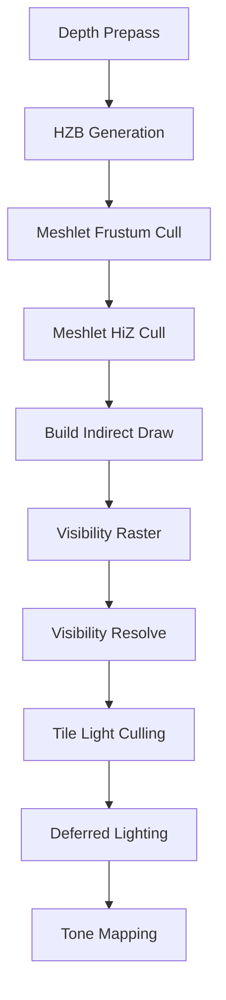
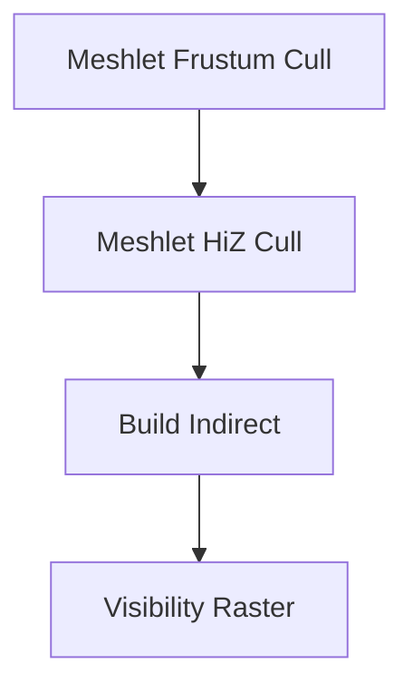
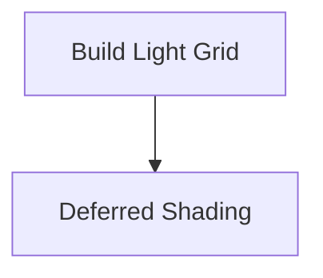
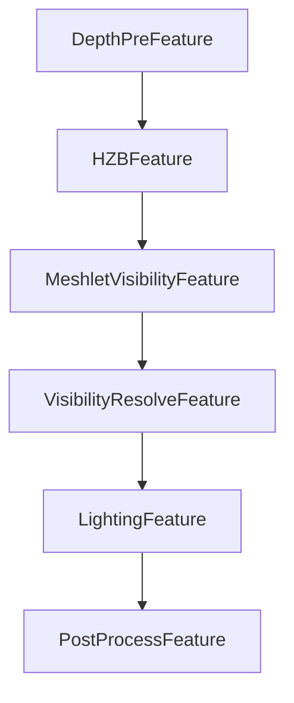

# GPU‑Driven Pipeline

This document defines the **baseline renderer architecture** for the libvultra.
The goal of this design is:

- **GPU‑Driven rendering**
- **High compatibility** (no mesh/task shaders required)
- **FrameGraph‑based scheduling**
- **Meshlet geometry pipeline**
- **Visibility buffer rendering**
- **Hi‑Z occlusion culling**
- **Tile‑based deferred lighting**
- **Future extensibility** (clustered lighting, SSR, SSAO, shadows)

The renderer is implemented as a set of **code‑driven RenderFeatures**, each contributing
one or more **passes** to the **FrameGraph**.

The FrameGraph is responsible only for:

- resource lifetime
- dependency tracking
- pass scheduling

Renderer logic remains **code‑driven**.

---

# 1. High‑Level Pipeline

The complete pipeline is shown below.



---

# 2. Render Features

The renderer is composed of the following features:

| Feature | Purpose |
|------|------|
|DepthPreFeature | Generates depth buffer |
|HZBFeature | Builds hierarchical Z buffer |
|MeshletVisibilityFeature | GPU‑driven meshlet visibility |
|VisibilityResolveFeature | Reconstructs GBuffer from visibility |
|LightingFeature | Tile‑based deferred lighting |
|PostProcessFeature | Tone mapping and final output |

---

# 3. FrameGraph Pass Structure

---

## 3.1 DepthPreFeature

### Pass
```
DepthPrePass
```

### Output

```
Depth
```

Purpose:

- early‑Z
- Hi‑Z generation
- SSAO / SSR support

---

## 3.2 HZBFeature

### Pass
```
HZBGeneratePass
```

### Input

```
Depth
```

### Output

```
HZB mip chain
```

Example layout:

```
HZB
 ├ mip0
 ├ mip1
 ├ mip2
 └ ...
```

---

## 3.3 MeshletVisibilityFeature

This is the **core GPU‑driven stage**.



### Passes

```
MeshletFrustumCullPass
MeshletHiZCullPass
BuildIndirectPass
VisibilityRasterPass
```

---

### MeshletFrustumCullPass

Compute pass performing:

- frustum culling
- meshlet cone backface test

Output:

```
CandidateMeshlets
```

---

### MeshletHiZCullPass

Compute pass performing:

- Hi‑Z occlusion test

Input:

```
CandidateMeshlets
HZB
```

Output:

```
VisibleMeshlets
```

---

### BuildIndirectPass

Compute pass converting visible meshlets into indirect draw commands.

Input:

```
VisibleMeshlets
```

Output:

```
IndirectDrawBuffer
```

Structure:

```cpp
struct DrawIndirectCommand
{
    uint indexCount;
    uint instanceCount;
    uint firstIndex;
    int  vertexOffset;
    uint firstInstance;
};
```

---

### VisibilityRasterPass

Graphics pass performing:

```
vkCmdDrawIndexedIndirect
```

Output:

```
VisibilityBuffer
Depth (tested)
```

Visibility buffer contains:

```
meshletId
primitiveId
barycentrics
```

---

## 3.4 VisibilityResolveFeature

### Pass

```
VisibilityResolvePass
```

### Input

```
VisibilityBuffer
Meshlet buffers
Vertex buffer
Material table
```

### Output

Thin GBuffer:

```
GBufferNormal
GBufferMaterial
Depth
(optional) GBufferAlbedo
```

This pass reconstructs shading attributes from meshlet geometry.

---

## 3.5 LightingFeature (Tile‑Based)

Lighting uses **tile‑based deferred shading**.



### Passes

```
BuildLightGridPass
DeferredShadePass
```

---

### BuildLightGridPass

Compute pass building a light list per screen tile.

Tile size:

```
16 x 16 pixels
```

Output:

```
TileLightHeaders
TileLightIndices
```

Example structure:

```cpp
struct TileLightHeader
{
    uint offset;
    uint count;
};
```

---

### DeferredShadePass

Fullscreen shading pass.

Input:

```
Thin GBuffer
TileLightList
```

Output:

```
HDRColor
```

Shader logic:

```
pixel → tileId → list of lights
```

---

## 3.6 PostProcessFeature

### Pass

```
ToneMappingPass
```

### Input

```
HDRColor
```

### Output

```
Backbuffer
```

Future post‑processing effects:

- Bloom
- TAA
- FXAA
- Color grading

---

# 4. FrameGraph Resource Overview

Key transient resources:

```
Depth
HZB

VisibilityBuffer

GBufferNormal
GBufferMaterial

TileLightHeaders
TileLightIndices

HDRColor
```

---

# 5. Persistent GPU Scene Buffers

These buffers exist outside the FrameGraph.

```
VertexBuffer

MeshletBuffer
MeshletVertices
MeshletTriangles
MeshletBounds

TransformBuffer
MaterialBuffer

LightBuffer
```

Additional GPU‑driven buffers:

```
VisibleMeshletBuffer
IndirectDrawBuffer
```

---

# 6. Feature Dependency Graph



---

# 7. Renderer Pass Count

Baseline renderer contains approximately:

```
DepthPrePass
HZBGeneratePass

MeshletFrustumCullPass
MeshletHiZCullPass
BuildIndirectPass
VisibilityRasterPass

VisibilityResolvePass

BuildLightGridPass
DeferredShadePass

ToneMappingPass
```

Total:

```
~10 passes
```

---

# 8. Future Extensions

Additional features can be integrated without modifying the core pipeline.

### ShadowFeature

```
ShadowMapPass
ShadowResolvePass
```

### SSAOFeature

```
SSAOPass
SSAOBlurPass
```

### SSRFeature

```
SSRTracePass
SSRResolvePass
```

### Clustered Lighting

Replace:

```
BuildLightGridPass
```

with:

```
BuildClustersPass
ClusterLightCullPass
```

The `DeferredShadePass` remains unchanged.

---

