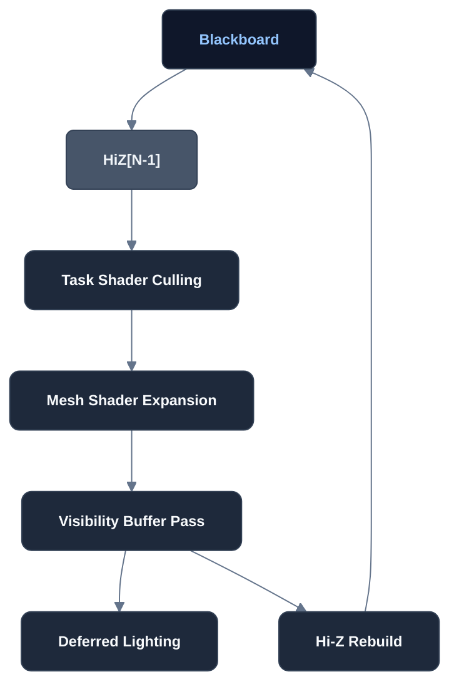

# Modern Render-Path Design (Draft)

## Goal
- Modern Techniques
- Fully GPU-Driven Pipeline

## FrameGraph

## FrameGraph Node Responsibilities

| #     | Node                                       | Inputs                                                 | Outputs                                | Responsibilities                                                                                                                                  |
| ----- | ------------------------------------------ | ------------------------------------------------------ | -------------------------------------- | ------------------------------------------------------------------------------------------------------------------------------------------------- |
| **1** | **Task Shader Culling**                           | • HiZ [N−1]  • Meshlet metadata  • Camera params | • Visible Meshlet List                 | Performs _GPU-driven culling_ (Frustum, Normal Cone, Hi-Z Occlusion) and selects proper LOD levels. Emits visible meshlets for the current frame. |
| **2** | **Mesh Shader Expansion**                  | • Visible Meshlet List  • Meshlet geometry buffers  | • Raster Primitives                    | Expands meshlets into vertices / triangles and submits them for hardware rasterization.                                                           |
| **3** | **Visibility Buffer Pass**                 | • Raster Primitives                                    | • Visibility Buffer  • Depth Buffer | Lightweight raster pass writing only Primitive ID + Material ID + Depth (replaces multi-MRT G-Buffer).                                            |
| **4** | **Deferred Lighting / Deferred Texturing** | • Visibility Buffer  • Material DB  • Light List | • Final Lit Color                      | Reconstructs surface data per pixel, fetches materials / textures, and performs BRDF lighting.                                                    |
| **5** | **Hi-Z Rebuild**                           | • Depth Buffer                                         | • HiZ [N]                              | Generates a new hierarchical Z pyramid from current frame depth and stores it back in the Blackboard for the next frame.                          |

## Blackboard / Persistent Resources

| Resource      | Lifetime                           | Description                                                                           |
| ------------- | ---------------------------------- | ------------------------------------------------------------------------------------- |
| **HiZ [N−1]** | Persistent (read-only this frame)  | Previous frame’s hierarchical Z buffer, used by **Task Shader Culling** for occlusion tests. |
| **HiZ [N]**   | Persistent (write-only this frame) | Rebuilt after rendering; becomes HiZ [N−1] for the next frame.                        |

## NOTE
- We don't need a Depth-PrePass since we are using Task + Mesh shaders to generate a V-Buffer.
- We don't implement Streaming (Virtual Geometries) for now for simplicity.