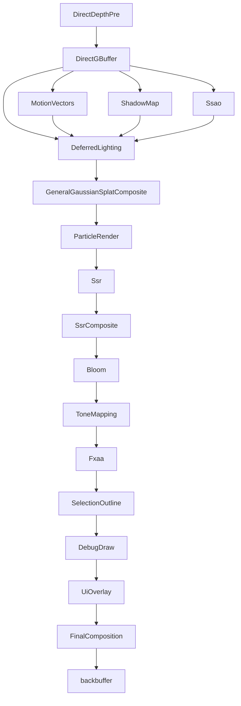

# GPU-Driven Pipeline

[English](../gpu_driven_pipeline.md) | **简体中文**

本文档描述 libvultra 在当前代码中所实现的**渲染器架构**。该子系统最初的设计意图是：

- **GPU 驱动的渲染**（针对 meshlet 几何体的计算剔除 + 间接绘制）
- **高兼容性**（无需 mesh/task 着色器）
- **基于 FrameGraph 的调度**
- **Meshlet 几何管线**，带有 **visibility buffer** 路径
- 针对屏幕空间效果、阴影和后处理的**可扩展性**

首先最需要理解的一点是**当前 pass 是如何连接起来的**：

> 渲染器是**声明式**的。Pass 由一份 JSON 渲染图
> （`*.vrg.json`）组合而成，该图由 `DeclarativeRenderer`
> （`source/vultra/src/function/rendering/srp/declarative_renderer.cpp`）加载并构建。图中每个节点的
> `type` 会解析为一个自注册的**内置 pass 适配器**
> （`IBuiltinRenderGraphPass`），声明于
> `builtin_passes_gpu_scene.cpp`、`builtin_passes_scene.cpp` 和
> `builtin_passes_post_process.cpp` 中。某些图节点类型则改为解析到一个
> `RenderFeature`（通过 `makeBuiltinFeature`）。**不存在**驱动默认帧的、固定的、手工连接的
> `RenderFeature` 类链条。

底层的 FrameGraph（`fg::FrameGraph`）现在仍然只负责：

- 资源生命周期
- 依赖跟踪
- pass 调度

Pass 主体和资源生产仍然在每个适配器/pass 内部由代码驱动。

---

# 1. 高层管线（出厂默认图）

默认的高端管线由 `builtin/render/universal.vrg.json` 定义。
它是一个围绕 `DirectGBuffer` + `DeferredLighting` 构建的延迟渲染器。
它**不**使用 meshlet / visibility-buffer 路径（见第 5 节）。

> 命名说明：该文件目前仍命名为 `universal.vrg.json`。计划将其重命名为
> `universal_highend.vrg.json`，但**尚未应用**；请引用当前名称。此外还存在两个层级变体：
> `universal_compat.vrg.json` 和 `universal_rt.vrg.json`。

节点图（每个节点都是一个内置 pass 适配器；箭头是 JSON 中声明的输入/输出资源依赖）：



按图顺序排列的 pass 列表，附带节点 `type`：

| Node id | type | 作用 |
|------|------|------|
| DirectDepthPre | `DirectDepthPre` | 深度预通道（early-Z） |
| DirectGBuffer | `DirectGBuffer` | 延迟 GBuffer 填充（color/normal/material/emissive/entityId + depth） |
| MotionVectors | `MotionVectors` | 逐像素运动矢量 |
| ShadowMap | `ShadowMap` | 级联阴影贴图（默认 4 个级联） |
| Ssao | `Ssao` | 屏幕空间环境光遮蔽（默认参数为禁用） |
| DeferredLighting | `DeferredLighting` | 单次全屏延迟着色 pass |
| GeneralGaussianSplatComposite | `GeneralGaussianSplatComposite` | 将 3DGS splat 合成到已着色颜色之上 |
| ParticleRender | `ParticleRender` | 前向粒子渲染 |
| Ssr | `Ssr` | 屏幕空间反射追踪（默认参数为禁用） |
| SsrComposite | `SsrComposite` | 将 SSR 合成到颜色之上（默认参数为禁用） |
| Bloom | `Bloom` | 泛光 |
| ToneMapping | `ToneMapping` | HDR -> 色调映射后的颜色（中间目标） |
| Fxaa | `Fxaa` | FXAA 抗锯齿 |
| SelectionOutline | `SelectionOutline` | 编辑器选中描边（使用 entityId） |
| DebugDraw | `DebugDraw` | 调试线条/形状叠加 |
| UiOverlay | `UiOverlay` | ImGui / UI 叠加 |
| FinalComposition | `FinalComposition` | 写入 **backbuffer** |

JSON 中的 `enabled` 标志和 `params`（例如 `Ssao.enabled = false`、
`Ssr.enabled = false`）控制某个 pass 是否执行工作；连接关系始终存在。

---

# 2. 内置 Pass 适配器

一个内置 pass 适配器实现了 `IBuiltinRenderGraphPass`。每个适配器：

- **拥有**它所驱动的 rhi pass 对象，
- 在 `specs()` 中声明其节点端口/参数规格（即槽位名称和参数的唯一真实来源），
- 在 `build()` 中运行其逐帧构建主体。

拥有者状态（实时构建上下文、服务、逐帧标志）通过
`BuiltinPassHost` 获取。完整的目录由
`makeBuiltinRenderGraphPasses()` 从以下各文件中的逐文件追加函数组合而成：

- `builtin_passes_gpu_scene.cpp`（meshlet 剔除链、gaussian splat、粒子）
- `builtin_passes_scene.cpp`（`DirectDepthPre`、`DirectGBuffer`、`DeferredLighting`、`ShadowMap`、……）
- `builtin_passes_post_process.cpp`（`Ssao`、`Ssr`/`SsrComposite`、`Bloom`、`ToneMapping`、`Fxaa`、`Hzb`、`FinalComposition`、……）

少数节点类型则通过 `declarative_renderer.cpp` 中的 `makeBuiltinFeature()`
解析为一个 `RenderFeature` 而不是单个适配器
（`compatibility_basecolor`、`direct_gbuffer`、`meshlet`、`general_gaussian_splat`、
`builtin_screen_space`、`final_composition`）。

---

# 3. 延迟 GBuffer 路径（默认）

## 3.1 DirectDepthPre

针对场景几何体的深度预通道。输出：

```
depth
```

用途：为 GBuffer 填充提供 early-Z，并为 SSAO/SSR/motion 提供深度来源。

## 3.2 DirectGBuffer

延迟 GBuffer 填充（由 `DirectGBufferFeature` /
`direct_gbuffer_pass.cpp` 驱动）。声明的输出：

```
color
depth
normal
material
emissive
entityId
```

## 3.3 DeferredLighting

一次**单次全屏**延迟着色 pass（`deferred_lighting_pass.cpp`）。
它**不**是基于 tile 的，也没有 light-grid / light-culling 计算 pass。

输入（来自 GBuffer + 阴影/AO）：

```
color, normal, material, emissive, depth
ao (optional, from Ssao)
shadowMap, shadowData (from ShadowMap)
```

光照数据：

- **点/区域光源**每帧作为一个固定容量的 uniform
  `GpuLightBlock`（set=1, binding=0）上传。容量为
  `kMaxDeferredPointLights = kMaxDeferredAreaLights = kMaxDeferredSpotLights = 32`。
  超出容量的光源会被丢弃。
- **方向光** + 阴影强度 + 环境光 + IBL 参数通过 push constants 传递。
- **IBL**（BRDF LUT + irradiance + 预过滤环境贴图，按需从环境贴图生成，
  带有 1x1 回退）以及 **LTC** LUT（用于区域光源）从 set=3 绑定。

输出：

```
DeferredLightingOutput   (RGBA16F, intermediate HDR color)
```

---

# 4. 后处理（默认）

这些 pass 在 `universal.vrg.json` 中已被**实现并连接**
（`builtin_passes_post_process.cpp`）：

| Pass | 说明 |
|------|------|
| `Ssao` | 基于水平线的 AO；默认参数 `enabled=false` |
| `Ssr` + `SsrComposite` | 屏幕空间反射；默认参数 `enabled=false` |
| `Bloom` | 默认启用 |
| `ToneMapping` | 配置文件 `eGeneral`；写入一个**中间** RGBA16F `ToneMappingOutput`，**而非** backbuffer |
| `Fxaa` | 默认启用 |
| `SelectionOutline`、`DebugDraw`、`UiOverlay` | 编辑器 / 叠加 pass |
| `FinalComposition` | 配置文件 `eGeneral`；采样最终颜色并写入 **backbuffer**（感知 sRGB），可选地输出 entityId 用于调试 |

还实现并连接了一个级联 `ShadowMap` pass（它馈送给
`DeferredLighting`），并非未来事项。

---

# 5. Meshlet / Visibility-Buffer 路径（实验性，**不在**默认图中）

> **状态：代码中已存在但当前未连接。** 没有任何 `*.vrg.json` 引用
> meshlet 或 visibility-buffer 的 pass，因此出厂管线从不运行它们。下面这些类
> 已存在并可构建，但在某个图将其连接之前应视为实验性。

真实的类（位于 `source/vultra/.../srp/builtin/features/` 和
`.../srp/builtin/passes/` 下）为：

- Features：`MeshletFeature`、`VisibilityBufferFeature`、`DepthHzbFeature`、
  `DirectGbufferFeature`、`CompatibilityBasecolorFeature`、
  `FinalCompositionFeature`、`BuiltinScreenSpaceFeature`、
  `GeneralGaussianSplatFeature`。
- Passes：`CoarseInstanceCullPass`、`MeshletCullPass`、`BuildIndirectPass`、
  `DrawsetBuildPass`、`DepthPrePass`、`VisibilityBufferPass`、`ThinGBufferPass`、
  `HzbGeneratePass`、`MeshletHiZCullPass`。

## 5.1 MeshletFeature

`MeshletFeature::addPasses()` 导入持久化场景缓冲区（第 7 节），
然后按以下顺序运行这些 pass：

```
CoarseInstanceCullPass
MeshletCullPass
BuildIndirectPass
DrawsetBuildPass
DepthPrePass
```

当前实现中的重要注意事项：

- **HiZ 遮挡剔除和 HZB 生成被跳过。** 该 feature 直接从视锥剔除输出构建
  最终 drawset（代码注释为 *"Skip HiZ/HZB for now"*）。`MeshletHiZCullPass` 在此处**未**被调用，
  而唯一的 HZB 生产者（`HzbGeneratePass`，由 `DepthHzbFeature` 使用）本身也未被连接。
- **Cone（背面）剔除存在但被硬编码关闭**，位于 `MeshletCullPass` 中
  （`enableConeCull = 0`）。

### CoarseInstanceCullPass
计算 pass；生产 `visibleInstance`、`visibleInstanceCount`、
`meshletCullDispatchArgs`。

### MeshletCullPass
计算 pass；对 meshlet 进行视锥剔除（cone 测试可用但已禁用）。
生产 `visibleMeshlet`、`visibleMeshletCount`。

### BuildIndirectPass
将可见 meshlet 转换为逐绘制记录的计算 pass。它的输出
`DrawBuffer` 是一个 **`resource::GpuDrawRecord`** 数组（步长为
`sizeof(resource::GpuDrawRecord)`），**而非** `VkDrawIndexedIndirectCommand`。它
派发 `(maxDraws + 63) / 64` 个 group。

### DrawsetBuildPass
构建供光栅 pass 消费的间接 / draw-set 缓冲区的计算 pass
（队列 opaque + alpha-mask；`kRenderQueueCount = 8`）。

### DepthPrePass
针对间接 drawset 的 meshlet 深度预通道（early-Z；当 HiZ 重新启用时预期作为 HZB 来源）。

## 5.2 VisibilityBufferFeature

运行两个 pass：先 `VisibilityBufferPass` 再 `ThinGBufferPass`，并将
thin-GBuffer 颜色作为 final-composition 的来源发布。

### VisibilityBufferPass

将 meshlet drawset 光栅化到**单个 `R32UI`**
visibility 目标（外加一个深度附件）的图形 pass。每个 texel 打包：

```
(drawId << 16) | triangleId
```

其中**没有** meshletId 字段、**没有**单独的 primitiveId，也**没有**存储
barycentrics —— barycentrics 在稍后的 resolve 中重新计算。绘制使用
**非索引** `vkCmdDrawIndirect`（通过 `rc.cb.drawIndirect(...)`），当多绘制间接不可用时
按命令逐个循环。它读取由 `BuildIndirectPass` / `DrawsetBuildPass` 生产的间接 /
draw-set 缓冲区。

### ThinGBufferPass（"resolve"）

resolve 步骤是 **`ThinGBufferPass`**（不存在 `VisibilityResolvePass`）。
它是一个**全屏三角形** pass，读取 visibility buffer 和 meshlet
/ 材质表，重新计算 barycentrics，并写入 4-5 个颜色附件：

```
0: ThinGBufferColor     (RGBA8_UNorm)
1: ThinGBufferNormal    (RG8_UNorm)
2: ThinGBufferMaterial  (RGBA8_UNorm)
3: ThinGBufferEmissive  (RGBA16F)
4: ThinGBufferEntityId  (RGBA8_UNorm, optional - only when entity-id/outline is on)
```

它**不**写入深度，也没有 "Albedo"/"GBufferAlbedo" 附件。

thin GBuffer 在布局上与延迟光照的输入兼容，因此如果某个图连接了此路径，
同一个 `DeferredLighting` pass 即可对其进行着色。

---

# 6. FrameGraph 资源概览

默认延迟路径（瞬态 FrameGraph 资源）：

```
DirectDepthPre.depth

DirectGBuffer: color, normal, material, emissive, entityId

Ssao.ao
ShadowMap: shadowMap, shadowData
MotionVectors

DeferredLightingOutput (RGBA16F)

ToneMappingOutput (RGBA16F)
... post-process chain ...

backbuffer (imported)
```

Meshlet/visibility 路径（瞬态，仅当该路径被连接时）：

```
visibleInstance / visibleInstanceCount / meshletCullDispatchArgs
visibleMeshlet / visibleMeshletCount
DrawBuffer / indirect / drawSet buffers
VisibilityBuffer (R32UI) + depth
ThinGBufferColor / Normal / Material / Emissive / (EntityId)
```

注意：可见 meshlet、间接和绘制缓冲区是由其计算 pass 生产的**瞬态** FrameGraph
资源，而非持久化场景缓冲区。

---

# 7. 持久化 GPU 场景缓冲区（meshlet 路径）

这些缓冲区位于 FrameGraph 之外，并由 meshlet 路径（只读）导入。来自
`MeshletFeature::addPasses()` /
`importDeclarativeGpuSceneBuffers()`：

```
gpuSceneDatabase->instanceBuffer
gpuSceneDatabase->meshTableBuffer
gpuSceneDatabase->transformBuffer
gpuSceneDatabase->skinMatrixBuffer
gpuSceneDatabase->resources->meshlets.meshletsBuffer
gpuSceneDatabase->resources->materialTableBuffer
gpuSceneDatabase->resources->materialParams.gpu
gpuSceneDatabase->resources->meshlets.meshletVerticesBuffer
gpuSceneDatabase->resources->meshlets.meshletTrianglesBuffer
```

**没有**持久化光源缓冲区：光源每帧作为
`GpuLightBlock` uniform 上传（第 3.3 节）。可见 meshlet / 间接 / 绘制
缓冲区是**瞬态**的，并非持久化。

---

# 8. 渲染层级

三个层级图在运行时选择所使用的管线：

- `universal.vrg.json` —— 高端延迟路径（默认；如上文档所述）。
  计划重命名为 `universal_highend.vrg.json`，但尚未应用。
- `universal_compat.vrg.json` —— 兼容性层级。
- `universal_rt.vrg.json` —— 光线追踪层级（见 `universal_rt_renderer.cpp` /
  `raytracing_primary_pass.cpp`）。

---

# 9. 未来 / 尚未连接

- **将 meshlet / visibility-buffer 路径连接**到一个图变体中，然后
  重新启用 HiZ 遮挡剔除（`MeshletHiZCullPass` + `HzbGeneratePass` /
  `DepthHzbFeature`）以及 meshlet cone 剔除。
- **Tiled / clustered 光照。** 当前的 `DeferredLighting` 是一个带有固定容量光源 uniform 的
  单次全屏 pass。未来的 clustered 或基于 tile 的 light-culling 计算 pass
  可以替换该 uniform 上传，而无需改变全屏着色结构。
- **额外的屏幕空间效果**可以作为后处理适配器添加，并连接到图 JSON 中，
  而无需触及核心场景 pass。
